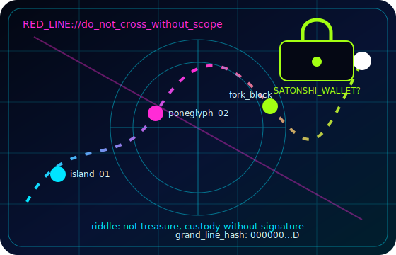
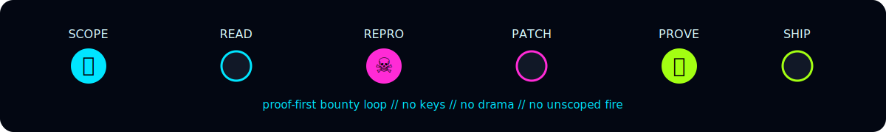
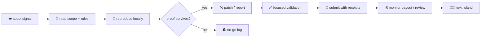

<!-- markdownlint-disable MD013 MD033 MD041 -->

<p align="center">
  
</p>

<p align="center">
  <a href="https://www.zerocracy.com/cv/34168">
    
  </a>
  
  
  
  
  
</p>

<p align="center">
  
</p>

<br />

<div align="center">

```text
      )  (        )        (        )          )      (       )
   ( /(  )\ )  ( /(        )\ )  ( /(       ( /(      )\ ) ( /(
   )\())(()/(  )\())  (   (()/(  )\())  (   )\()) (  (()/( )\())
  ((_)\  /(_))((_)\   )\   /(_))((_)\   )\ ((_)\  )\  /(_)|_))/
   _((_)(_))    ((_) ((_) (_))    ((_) ((_) _((_)((_)(_)) | |_
  | || ||_ _|  / _ \/ __||_ _|  / _ \/ __|| || || __| _ \|  _|
  | __ | | |  | (_) \__ \ | |  | (_) \__ \| __ || _||   /| |
  |_||_||___|  \___/|___/|___|  \___/|___/|_||_||___|_|_\ \__|

             CYBER ASH ENGINE // RECEIPTS IN THE FIRE
```

</div>

---

### 🧬 `operator.signal`

I ship **paid OSS fixes, scoped security research, fork/local PoCs, GitHub-native bounty work, and automation loops**. The vibe is dark, but the rules stay clean:

```solidity
if (scope.clear() && proof.reproduces() && impact.real()) {
    submit_with_receipts();
} else {
    log_no_go();
    move_to_next_signal();
}
```

No spam. No fake severity. No loose keys. No wallet theater. Just patched code, reproducible proof, and the next clean target.

<p align="center">
  
</p>

---

## 🏴‍☠️ `the_one_piece.riddle`

> Under the red line, below the merkle tide,
> where forks remember what mainnet denied,
> three ghosts count blocks by candlelight:
> **one wears a hood, one holds a key, one signs nothing.**
>
> The last poneglyph is not stone.
> It is a wallet with no UI.
> The name was misspelled on purpose: **Satonshi**.
> Find the address that owns no throne,
> and the sea will return the first coin.

<p align="center">
  
</p>

---

## 🧨 `arsenal.loadout`

<p align="center">
  
</p>

<p align="center">
  
  
  
  
  
  
</p>

| System | What it does | Proof artifact |
| --- | --- | --- |
| 🧩 `oss_patch_loop` | Small, reviewable fixes against live issues | branch, PR, focused test, diff check |
| 🛡️ `scope_guard` | Reads rules before touching targets | scope note, safe method, duplicate sweep |
| 🔥 `fork_poc` | Replays exploit math in local/fork sandboxes | command, block number, assertions |
| 🧠 `agent_mesh` | Coordinates monitors, ledgers, prompts | receipts, status logs, no-secret handoff |
| 💸 `payout_watch` | Tracks accepted work without account-risk actions | public receipts, dashboard-safe notes |

---

## 🕸️ `graph.neural_map`



---

## 📡 `live.telemetry`

<p align="center">
  
  
</p>

<p align="center">
  
  
</p>

<p align="center">
  
</p>

<p align="center">
  
</p>

---

## 🧾 `verified.current_signal`

<p align="center">
  
  
  
  
</p>

```text
GHX5T-SOL doctrine:
  01. one clean PR beats ten noisy comments
  02. one reproducible exploit beats one dramatic headline
  03. one payout receipt beats a thousand vibes
  04. one hidden wallet waits beneath the hash fog
```

---

<p align="center">
  
</p>

<p align="center">
  <sub>
    👻 hood up | 🪽 wings armed | 🔥 proof in the fire | 🏴‍☠️ follow the hash tide | 🧬 ghost in shell mode
  </sub>
</p>
