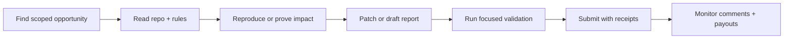

<!-- markdownlint-disable MD013 MD033 MD041 -->

<p align="center">
  
</p>

<p align="center">
  <a href="https://www.zerocracy.com/cv/34168">
    
  </a>
  
  
  
</p>

<p align="center">
  
</p>

---

## 👋 About

I work on **paid open-source contributions, security research, bug bounty reports, and automation tooling**. The style is simple: find real issues, make narrow fixes, run the proof, and leave clean receipts.

```text
current_mode = "cash-first, proof-first"
default_output = "small PRs, reproducible tests, clear reports"
anti_goals = ["spam", "low-signal reports", "unverified claims", "secret leakage"]
```

## ⚡ What I Ship

| Lane | What I do | Proof I care about |
| --- | --- | --- |
| 🧩 OSS fixes | Small, reviewable PRs against real issues | Tests, CI, clear maintainer path |
| 🛡️ Security | Scoped source review, fork/local PoCs, report hardening | Repro steps, impact, duplicate checks |
| 🤖 Automation | Agent workflows, repo scaffolds, payout monitors | Logs, receipts, safe gates |
| 💸 Bounties | Zerocracy, GitHub-native bounty work, paid issue triage | Merged PRs, accepted reports, payouts |

## 🧰 Stack & Tools

<p align="center">
  
</p>

<p align="center">
  
  
  
  
  
  
  
  
</p>

## 🧭 Operating Principles



- ✅ **Verified over loud**: no proof, no claim.
- ✅ **Small diffs win**: maintainers should know exactly what changed.
- ✅ **Scope matters**: security work stays inside program rules.
- ✅ **Receipts everywhere**: commands, hashes, links, and status.
- ✅ **Human gates stay human**: payout, legal, KYC, wallets, and keys are not automated.

## 📊 GitHub Signals

<p align="center">
  
  
</p>

<p align="center">
  
  
</p>

<p align="center">
  
</p>

<p align="center">
  
</p>

## 🏆 Trophy Case

<p align="center">
  
</p>

## 🚀 Current Focus

<p align="center">
  
  
  
  
</p>

```text
if opportunity.is_real() and scope.is_clear() and proof.can_run():
    ship()
else:
    log_no_go_and_move_on()
```

---

<p align="center">
  
</p>
